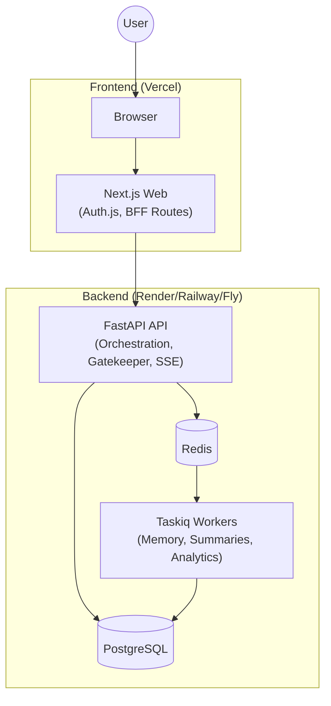

# NudgeEn Tech Stack

> Last updated: 2026-04-26

## Target Stack

| Layer | Technology | Why |
| --- | --- | --- |
| Web App / BFF | Next.js Web | SSR/App Router, session handling, thin BFF endpoints close to UI |
| API Service | FastAPI, Pydantic v2 | Strong typing, async I/O, clean service boundaries |
| Database | PostgreSQL 16 | ACID, row-level locking, JSONB, indexing, mature scaling path |
| Cache / Broker | Redis 7 | Low-latency cache, rate limiting, queue transport |
| Queue | Taskiq + Redis broker | Async-first Python queue, good fit for FastAPI worker model |
| ORM / Migrations | SQLAlchemy async, Alembic | Explicit schema control and migration discipline |
| AI Providers | Gemini 2.5 Flash primary, Groq fallback | Cost/latency balance and resilience |
| Realtime Delivery | SSE first, optional WebSocket later | Simpler operationally for streamed chat responses |
| Observability | Structured logs, metrics, traces, Sentry/OpenTelemetry | Debuggability across API and worker boundaries |
| Deployment | Vercel for web, Render/Railway/Fly for API + workers, managed Postgres/Redis | Low ops overhead with independent scaling |

## Deployment Shape

## Why This Stack

- PostgreSQL is the system of record from day one, providing robust ACID transactions and a mature scaling path.
- Redis is shared deliberately across three concerns only: queue transport, short-lived cache, and rate limiting.
- Worker processes are mandatory, not optional. They keep heavy LLM and post-processing work off the chat response path.
- Next.js acts as the web-facing entry point, but business logic stays in FastAPI to avoid duplicating orchestration logic.

## Non-Negotiable Technical Rules

- Do not use PostgreSQL as a queue.
- Do not run memory extraction inline with the chat response request.
- Do not let frontend talk directly to Redis or the primary database.
- All async jobs must be idempotent and retry-safe.
- All writes that can be triggered twice must carry an idempotency key or unique business key.

## Core Dependencies

### Web

- `next`
- `react`
- `typescript`
- `auth.js` / `next-auth`
- `zod`

### API / Worker

- `fastapi`
- `uvicorn`
- `pydantic`
- `pydantic-settings`
- `sqlalchemy[asyncio]`
- `psycopg[binary,pool]`
- `alembic`
- `redis`
- `taskiq`
- `taskiq-redis`
- `google-generativeai`
- `groq`

## Scaling Guidance

| Stage | Recommended Shape |
| --- | --- |
| 0 to 1k DAU | 1 web, 1 API, 1 worker, managed Postgres, managed Redis |
| 1k to 20k DAU | 1 to 2 web, 2 to 4 API, 2 to 6 workers, PgBouncer/Supavisor, Redis HA |
| 20k+ DAU | Separate worker pools by job type, read replicas, stronger observability, backpressure controls |
