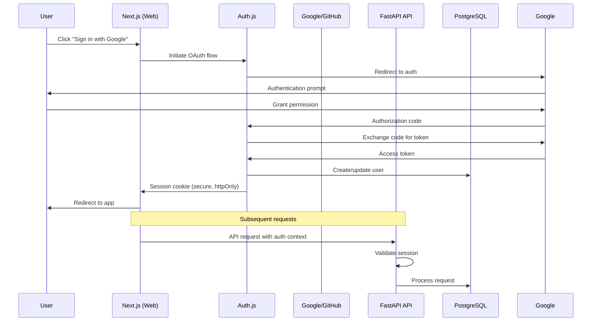
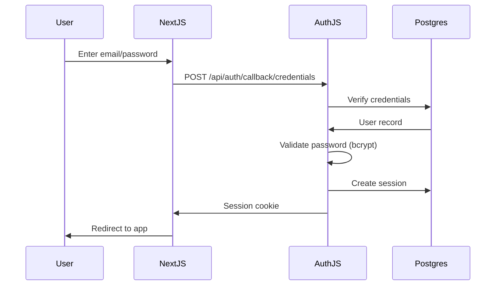
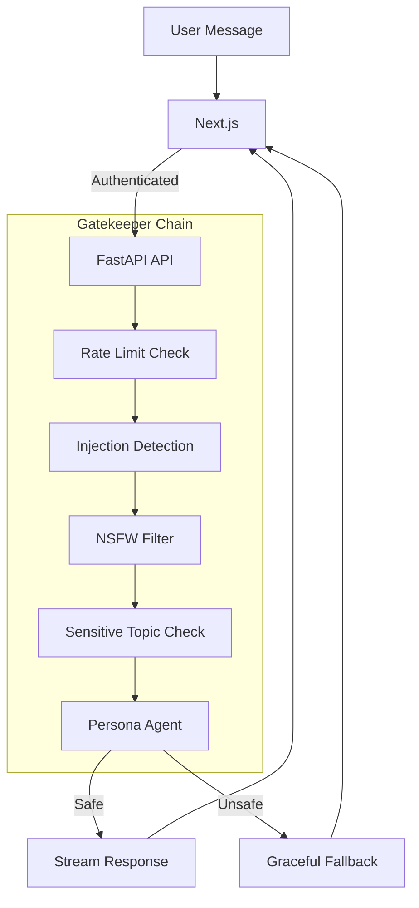

# EPIC-01: Security, Auth & Guardrails

**Focus:** Auth.js, credentials, OAuth, safety controls  
**Status:** Pending (Planned for Sprint 1)  
**Sprint:** Sprint 1: Scalable Gateway  
**Priority:** P0 - Critical Path

---

## Epic Description

Implement comprehensive authentication, authorization, and safety control infrastructure. This epic establishes the identity boundary for the application, ensuring secure user access while protecting against malicious inputs and unsafe AI behavior. It creates the trust foundation that allows users to interact with their AI friend safely.

This epic builds directly on the infrastructure foundation from EPIC-00 and enables the user-facing features in EPIC-02 and beyond.

---

## Business Value

- **User Trust:** Secure authentication protects user accounts and conversation privacy.
- **Safety First:** Prevents harmful content, prompt injection, and rogue AI behavior.
- **Regulatory Compliance:** Supports future privacy regulations with proper data handling.
- **Abuse Prevention:** Rate limiting and monitoring prevent spam and misuse.

---

## Scope

### In Scope

- ✅ Auth.js integration with Next.js (web boundary)
- ✅ Google and GitHub OAuth providers
- ✅ Credentials provider (email/password)
- ✅ PostgreSQL adapter for Auth.js persistence
- ✅ JWT/session token management
- ✅ User role and permission system
- ✅ Safety gatekeeper agent (pre-chat validation)
- ✅ NSFW and sensitive topic filtering
- ✅ Prompt injection detection and prevention
- ✅ Rate limiting (50 messages/24hrs per user, MVP)
- ✅ Redis-based sliding window rate limiter
- ✅ Abuse event tracking and logging
- ✅ IP-based and account-based rate limiting
- ✅ Content safety classification
- ✅ PII scrubbing pipeline for memory extraction
- ✅ User data export and deletion (GDPR compliance)
- ✅ Session management and refresh
- ✅ Password reset flow
- ✅ Email verification (for credentials provider)

### Out of Scope

- ❌ Multi-factor authentication (MFA) (future enhancement)
- ❌ Social login beyond Google and GitHub (future enhancement)
- ❌ Enterprise SSO (SAML, OIDC) (future enhancement)
- ❌ Advanced CAPTCHA or bot detection (initial MVP)
- ❌ Real-time abuse response (automated account suspension)

---

## Key Requirements

### REQ-AUTH-01: OAuth Integration

**From:** PRD-v1.md (REQ-007)

- Implement Google OAuth2 provider via Auth.js
- Implement GitHub OAuth provider via Auth.js
- Store OAuth tokens securely (encrypted at rest)
- Handle OAuth token refresh automatically
- Link multiple OAuth providers to same account

### REQ-AUTH-02: Credentials Provider

- Email/password authentication with Auth.js
- Password complexity requirements (min 8 chars, mixed case, number)
- Secure password hashing (bcrypt/scrypt)
- Email verification for new accounts
- Password reset with time-limited tokens

### REQ-AUTH-03: PostgreSQL Adapter

- Auth.js adapter for PostgreSQL (next-auth/prisma or custom)
- Store users, accounts, sessions, verification tokens
- Session persistence and expiration
- Concurrent session management

### REQ-AUTH-04: Safety Gatekeeper

**From:** PRD-v1.md (REQ-008)

- Lightweight prompt evaluation before Persona Agent
- Sequential execution: Gatekeeper → Persona → Response
- Input classification for safety risks
- Output validation before streaming to user
- NSFW content detection and blocking
- Sensitive topic filtering (self-harm, violence, etc.)
- Graceful fallback responses when triggered
- Logging of safety events for monitoring

### REQ-AUTH-05: Prompt Injection Prevention

- Detect common prompt injection patterns
- Sanitize user input to prevent system prompt leakage
- Context boundary enforcement
- Rate limiting on suspicious patterns
- Separate system and user message boundaries

### REQ-AUTH-06: Rate Limiting

**From:** PRD-v1.md (REQ-010)

- Redis-based sliding window rate limiter
- 50 messages per 24 hours per user (MVP)
- Per-IP rate limiting for unauthenticated endpoints
- Configurable limits per user tier (future)
- Clear error messages when rate limit exceeded
- Retry-After header in responses

### REQ-AUTH-07: PII Scrubbing

**From:** PRD-v1.md (Security & Privacy)

- Filter phone numbers before memory persistence
- Filter specific addresses before memory persistence
- Configurable PII patterns (regex-based)
- Preserve non-sensitive personal details (hobbies, preferences)
- Audit logging of scrubbed content (metadata only)

### REQ-AUTH-08: Data Deletion

- "Wipe My Memory" button functionality
- Delete user_memories table entries
- Update user_profiles to reset state
- Soft-delete conversations or anonymize
- GDPR-compliant data export endpoint

---

## Technical Design

### Authentication Flow

#### OAuth Flow



#### Credentials Flow



### Safety Gatekeeper Architecture



### Rate Limiting Implementation

**Redis Sliding Window:**

```python
import redis
import time

async def check_rate_limit(user_id: str, limit: int = 50, window: int = 86400):
    """Sliding window rate limiter using Redis sorted sets."""
    key = f"rate_limit:{user_id}"
    now = time.time()
    window_start = now - window
    
    async with redis_client.pipeline() as pipe:
        # Remove old entries
        pipe.zremrangebyscore(key, 0, window_start)
        # Count current entries
        pipe.zcard(key)
        # Add current request
        pipe.zadd(key, {str(now): now})
        # Expire key
        pipe.expire(key, window)
        results = await pipe.execute()
    
    current_count = results[1]
    return current_count < limit
```

### PII Scrubbing Pipeline

```python
import re

PII_PATTERNS = {
    'phone': re.compile(r'\b(?:\+?1[-.\s]?)?\(?([0-9]{3})\)?[-.\s]?([0-9]{3})[-.\s]?([0-9]{4})\b'),
    'email': re.compile(r'\b[A-Za-z0-9._%+-]+@[A-Za-z0-9.-]+\.[A-Z|a-z]{2,}\b'),
    'ssn': re.compile(r'\b\d{3}-\d{2}-\d{4}\b'),
    # Addresses: more complex, use NLP or conservative pattern
}

def scrub_pii(text: str) -> tuple[str, list[str]]:
    """Scrub PII from text, return (cleaned_text, redacted_items)."""
    redacted = []
    cleaned = text
    
    for pii_type, pattern in PII_PATTERNS.items():
        matches = pattern.findall(cleaned)
        if matches:
            redacted.extend([f"{pii_type}: {m}" for m in matches])
            cleaned = pattern.sub(f'[{pii_type.upper()}_REDACTED]', cleaned)
    
    return cleaned, redacted
```

### Session Configuration (Next.js + Auth.js)

```typescript
// auth.ts
import NextAuth from "next-auth"
import Google from "next-auth/providers/google"
import GitHub from "next-auth/providers/github"
import Credentials from "next-auth/providers/credentials"
// Use PostgreSQL adapter directly to avoid multi-ORM complexity
import PostgresAdapter from "@auth/pg-adapter"
import { Pool } from "pg"

const pool = new Pool({
  connectionString: process.env.DATABASE_URL,
})

export const { handlers, auth, signIn, signOut } = NextAuth({
  adapter: PostgresAdapter(pool),
  providers: [
    Google({
      clientId: process.env.GOOGLE_CLIENT_ID!,
      clientSecret: process.env.GOOGLE_CLIENT_SECRET!,
    }),
    GitHub({
      clientId: process.env.GITHUB_CLIENT_ID!,
      clientSecret: process.env.GITHUB_CLIENT_SECRET!,
    }),
    Credentials({
      credentials: {
        email: { label: "Email" },
        password: { label: "Password", type: "password" },
      },
      async authorize(credentials) {
        // Validate credentials against database
        const user = await validateUser(credentials?.email as string, credentials?.password as string)
        return user
      },
    }),
  ],
  session: {
    strategy: "jwt",
    maxAge: 30 * 24 * 60 * 60, // 30 days
  },
  callbacks: {
    async jwt({ token, user }) {
      if (user) {
        token.id = user.id
      }
      return token
    },
    async session({ session, token }) {
      if (session.user) {
        session.user.id = token.id as string
      }
      return session
    },
  },
})
```

### FastAPI Authentication Middleware

```python
# app/core/security.py
from fastapi import Request, HTTPException
from fastapi.security import HTTPBearer
import jwt

security = HTTPBearer()

def get_current_user(request: Request) -> dict:
    """Validate JWT from Next.js session."""
    # In production, use a shared secret or public key
    # For simplicity, we trust the Next.js session context
    # passed via internal headers or validated JWT
    auth_header = request.headers.get("authorization")
    if not auth_header:
        raise HTTPException(status_code=401, detail="Not authenticated")
    
    # Validate token
    try:
        token = auth_header.replace("Bearer ", "")
        payload = jwt.decode(token, SECRET_KEY, algorithms=["HS256"])
        return payload
    except jwt.InvalidTokenError:
        raise HTTPException(status_code=401, detail="Invalid token")
```

---

## Acceptance Criteria

### Must Have

- [ ] Google OAuth provider configured and working
- [ ] GitHub OAuth provider configured and working
- [ ] Credentials provider (email/password) working
- [ ] PostgreSQL adapter storing sessions correctly
- [ ] Session persistence across server restarts
- [ ] Rate limiting active (50 msgs/24hr default)
- [ ] Safety gatekeeper runs before every chat message
- [ ] NSFW/content filtering blocks unsafe content
- [ ] Prompt injection detection in place
- [ ] PII scrubbing function implemented and tested
- [ ] "Wipe My Memory" endpoint working
- [ ] Password reset flow functional
- [ ] Email verification for new accounts
- [ ] Abuse events logged to database
- [ ] Clear error messages for auth failures

### Should Have

- [ ] Concurrent session management
- [ ] Session refresh without re-login
- [ ] Rate limit override for admin users (future)
- [ ] Detailed audit log for security events
- [ ] Suspicious activity monitoring
- [ ] Account lockout after repeated failures

### Could Have

- [ ] Remember me functionality
- [ ] Social account linking/unlinking UI
- [ ] Account deletion with confirmation flow
- [ ] Data export in JSON format

### Won't Have (This Epic)

- ❌ MFA/TOTP (future enhancement)
- ❌ Enterprise SSO (future enhancement)
- ❌ Advanced bot detection (CAPTCHA etc.)
- ❌ Real-time automated account suspension

---

## Dependencies

### External Dependencies

- **Auth.js** (next-auth) - Authentication framework
- **Google OAuth** - OAuth provider
- **GitHub OAuth** - OAuth provider
- **bcrypt** - Password hashing
- **@auth/pg-adapter** - PostgreSQL adapter for Auth.js

### Internal Dependencies

- **EPIC-00: Infrastructure & Project Setup** - Must be completed first
  - FastAPI project skeleton
  - Next.js project skeleton
  - PostgreSQL connection
  - Redis connection

---

## Timeline & Milestones

**Sprint 1: Scalable Gateway** (Target: 2 weeks)

| Milestone | Target Date | Deliverable |
|-----------|-------------|-------------|
| M1 | Day 2 | OAuth providers configured in Next.js |
| M2 | Day 4 | Credentials provider working |
| M3 | Day 5 | PostgreSQL adapter storing sessions |
| M4 | Day 7 | Rate limiting implemented in Redis |
| M5 | Day 9 | Safety gatekeeper integrated in FastAPI |
| M6 | Day 10 | PII scrubbing pipeline functional |
| M7 | Day 11 | "Wipe My Memory" endpoint working |
| M8 | Day 12 | Abuse logging implemented |
| M9 | Day 13 | Security testing and validation |
| M10 | Day 14 | Epic-01 acceptance criteria met |

---

## Risks & Mitigations

| Risk | Impact | Probability | Mitigation |
|------|--------|-------------|------------|
| OAuth configuration errors | High | Medium | Use official libraries, test thoroughly in dev |
| Session security vulnerabilities | Critical | Low | HttpOnly cookies, secure flags, short expiry |
| Rate limit bypass | Medium | Low | Multiple layers (IP + account), Redis atomic ops |
| False positives in content filtering | Medium | Medium | Adjustable thresholds, human review option |
| PII scrubbing misses data | High | Medium | Multiple pattern types, audit sampling |
| Password reset token leakage | High | Low | Short expiry, single-use tokens |

---

## Success Metrics

- **Authentication Success Rate:** > 99.5%
- **Session Hijacking Incidents:** 0
- **Rate Limit Effectiveness:** > 95% of abuse attempts blocked
- **Safety Gatekeeper Trigger Rate:** < 1% of messages (low false positive rate)
- **PII in Memory Storage:** 0 (fully scrubbed)
- **Password Reset Success Rate:** > 95%
- **OAuth Configuration Errors:** 0 in production
- **Average Auth Response Time:** < 200ms

---

## Out of Scope for This Epic

The following will be addressed in their respective epics:

- **EPIC-00:** Basic project structure, database schemas, dev environment
- **EPIC-02:** Chat UI, message display, typing indicators
- **EPIC-03:** AI provider integration, memory extraction logic
- **EPIC-04:** Correction generation, progress cards
- **EPIC-05:** Production deployment, advanced observability

---

## References

- [PRD-v1.md](../../PRD-v1.md) - Product requirements (REQ-007, REQ-008, REQ-010)
- [ARCHITECTURE.md](../../ARCHITECTURE.md) - System architecture
- [TECHSTACK.md](../../TECHSTACK.md) - Technology choices
- [PRINCIPLES.md](../../PRINCIPLES.md) - Design principles (Privacy, Security)
- [ONBOARDING.md](../../ONBOARDING.md) - Team onboarding

---

## Revision History

| Version | Date | Author | Description |
|---------|------|--------|-------------|
| 1.0 | 2026-04-26 | System | Initial version based on project documentation |
