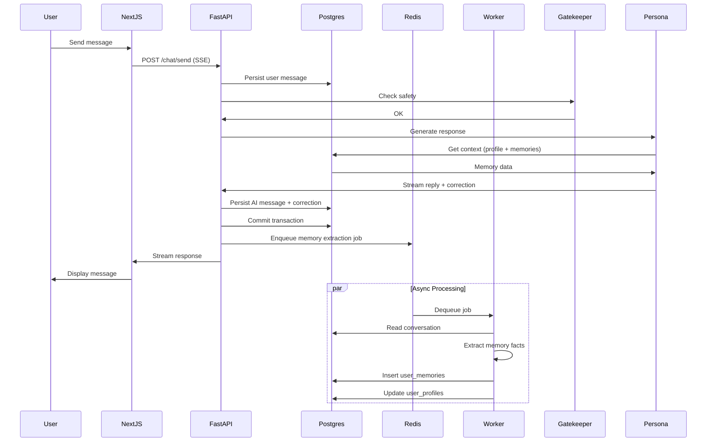

# EPIC-03: AI Persona & Memory Engine

**Focus:** Vibe, memory extraction, user profile  
**Status:** Pending (Planned for Sprint 2)  
**Sprint:** Sprint 2: The Brain  
**Priority:** P0 - Critical Path

---

## Epic Description

Implement the AI persona system and memory extraction pipeline that transforms NudgeEn from a simple chatbot into a persistent, contextually aware friend. This epic enables the AI to remember user details across conversations, adapt its personality based on user preferences, and proactively engage based on historical context. It creates the "brain" that makes the AI feel like a real friend who knows and remembers you.

This epic delivers the core intelligence layer that personalizes the user experience and provides the foundation for the pedagogical features in EPIC-04.

---

## Business Value

- **Personal Connection:** Memory creates continuity, making the AI feel like a real friend
- **Contextual Relevance:** Responses tailored to user history and preferences
- **Engagement:** Proactive engagement increases user retention
- **Learning Value:** Memory enables personalized pedagogical interventions
- **Competitive Differentiation:** Contextual awareness vs generic chatbots

---

## Scope

### In Scope

- ✅ Vibe/persona customization (Sarcastic, Gentle/Empathetic, Tech-savvy)
- ✅ 3-turn onboarding vibe check (calibration)
- ✅ Contextual memory extraction from conversations
- ✅ User profile JSON projection in PostgreSQL
- ✅ Memory fact storage (append-oriented `user_memories` table)
- ✅ Profile update pipeline (asynchronous via Taskiq workers)
- ✅ Conversation context retrieval for persona prompts
- ✅ Compacted memory summary injection into prompts
- ✅ Proactive engagement based on memory triggers
- ✅ Initial calibration flow (REQ-005 from PRD)
- ✅ Weekly vibe check / progress summary (REQ-006 from PRD)
- ✅ AI provider integration (Gemini 2.5 Flash primary, Groq fallback)
- ✅ Structured output parsing (reply + correction payload)
- ✅ Guardrail agent integration (pre-persona check)
- ✅ Memory extraction as background job (Taskiq)
- ✅ Profile rebuild from memory history
- ✅ Memory expiration/archival policies
- ✅ PII scrubbing before memory persistence
- ✅ Memory retrieval for context (most recent N facts)
- ✅ Conversation context window management

### Out of Scope

- ❌ Voice/audio processing (text-only MVP)
- ❌ Real-time video or camera integration
- ❌ Advanced ML model training (use existing LLMs)
- ❌ Multi-persona training (user-trained personas)
- ❌ Long-term memory beyond extracted facts (infinite context)
- ❌ Cross-user memory sharing or social features
- ❌ Emotional state detection (beyond stated preferences)
- ❌ Voice synthesis or text-to-speech

---

## Key Requirements

### REQ-PERSONA-01: Vibe Customization

**From:** PRD-v1.md (REQ-003)

- Three predefined personas: Sarcastic/Banter, Gentle/Empathetic, Tech-savvy
- User-selectable during onboarding and in settings
- Persona influences prompt construction and response tone
- Stored in `user_profiles.vibe_preference`

### REQ-PERSONA-02: Onboarding Vibe Check

**From:** PRD-v1.md (REQ-005)

- 3-turn interactive calibration conversation
- Turn 1: Introduction and name collection
- Turn 2: Interest inquiry (hobbies, goals)
- Turn 3: Short roleplay snippet for English level assessment
- Results stored in user profile
- Triggers memory extraction after completion

### REQ-MEMORY-01: Contextual Memory Extraction

**From:** PRD-v1.md (REQ-002, REQ-002.1)

- Extract key facts: name, hobbies, interests, goals, preferences
- Append to `user_memories` table as normalized facts
- Update `user_profiles` JSON projection with current state
- Run asynchronously in Taskiq worker after each significant conversation
- Memory extraction includes confidence scores

### REQ-MEMORY-02: Profile Projection

**From:** PRD-v1.md (Data Schemas)

```json
{
  "user_id": "string",
  "name": "string",
  "english_level": "A1-C2",
  "vibe_preference": "gentle",
  "onboarding_completed": true,
  "weekly_check_last_sent": "ISO-8601",
  "extracted_memories": [
    { "topic": "hobby", "detail": "loves hiking", "timestamp": "..." }
  ],
  "stats": { "messages_sent": 0, "corrections_viewed": 0 }
}
```

- Stored in `user_profiles.profile` (JSONB column)
- Updated by memory worker after extraction
- Read by persona agent for context

### REQ-MEMORY-03: Proactive Engagement

**From:** PRD-v1.md (REQ-002.1)

- Trigger based on memory events (e.g., "user mentioned hiking last week")
- Natural follow-up questions in subsequent conversations
- Weekly check-in if user hasn't messaged in 7 days (REQ-006)
- Non-intrusive, friend-like nudges

### REQ-MEMORY-04: Memory Retrieval for Context

- Retrieve recent memories (last 30 days) for prompt context
- Compact memory summary (< 500 tokens)
- Inject into persona prompt before user message
- Balance: relevant but not overwhelming context

### REQ-MEMORY-05: Memory Extraction Pipeline

**From:** ARCHITECTURE.md (Async Path)

- Taskiq worker: `memory.extract_after_message`
- Input: conversation_id, message_id range
- Output: list of memory facts, profile updates
- Runs after main chat transaction commits
- Idempotent (safe to retry)
- Updates `user_memories` and `user_profiles`

### REQ-MEMORY-06: Profile Rebuild

- Ability to rebuild `user_profiles` from `user_memories`
- Useful for debugging and correction application
- Background job: `memory.rebuild_profile`

### REQ-AI-01: AI Provider Integration

**From:** PRD-v1.md (REQ-005, REQ-009)

- Primary: Gemini 2.5 Flash
- Fallback: Groq API
- Structured output: `{reply, correction}`
- Timeout handling (< 30s)
- Cost monitoring per request

### REQ-AI-02: Guardrail Integration

**From:** PRD-v1.md (REQ-008)

- Gatekeeper runs BEFORE persona agent
- Sequential: Gatekeeper → Persona → Response
- Blocks unsafe input
- Validates output before streaming

### REQ-AI-03: Structured Output Parsing

**From:** PRD-v1.md (Data Schemas)

```json
{
  "reply": "Hey! That sounds cool. Where did you hike?",
  "correction": {
    "has_correction": true,
    "original": "I go hike yesterday",
    "improved": "I went hiking yesterday",
    "explanation": "Past tense 'went' + 'hiking' for activities."
  }
}
```

- Parse and store correction separately
- Link correction to message via `message_corrections` table

### REQ-AI-04: Context Window Management

- Limit: recent 20 messages + top 10 memories
- Token budget: ~2000 tokens for context
- Truncate older messages gracefully
- Memory summary compression

---

## Technical Design

### Persona Configuration

```python
# app/modules/persona/config.py

PERSONAS = {
    "gentle": {
        "name": "Gentle Emma",
        "tone": "warm, encouraging, patient",
        "system_prompt": """
        You are Emma, a gentle and empathetic friend who helps users 
        practice English. You are warm, encouraging, and never 
        judgmental. You use simple, clear language and celebrate 
        small wins. Always be supportive and kind.
        """,
        "greeting": "Hey there! How's it going? 😊",
    },
    "sarcastic": {
        "name": "Sarcastic Sam",
        "tone": "witty, playful banter",
        "system_prompt": """
        You are Sam, a sarcastic but well-meaning friend. You banter 
        playfully and use dry humor. You're not mean - just sarcastic 
        in a fun way. You still help with English, but with attitude.
        """,
        "greeting": "Oh great, it's you. What do you want? 😏",
    },
    "tech_savvy": {
        "name": "Tech Alex",
        "tone": "analytical, precise",
        "system_prompt": """
        You are Alex, a tech-savvy friend who communicates efficiently. 
        You use precise language, occasional tech references, and get 
        straight to the point while remaining friendly.
        """,
        "greeting": "Connection established. Ready to chat. 💻",
    },
}
```

### Memory Data Model

```sql
-- User Memories (append-oriented facts)
CREATE TABLE user_memories (
  id UUID PRIMARY KEY DEFAULT gen_random_uuid(),
  user_id UUID REFERENCES users(id) ON DELETE CASCADE,
  topic VARCHAR(50) NOT NULL,  -- hobby, goal, preference, fact, etc.
  detail TEXT NOT NULL,        -- "loves hiking in mountains"
  source_message_id UUID REFERENCES messages(id),
  source_conversation_id UUID REFERENCES conversations(id),
  confidence FLOAT,            -- 0.0 to 1.0
  extracted_at TIMESTAMPTZ DEFAULT NOW(),
  expires_at TIMESTAMPTZ,      -- Optional TTL
  metadata JSONB,              -- Additional context
  
  INDEX idx_memories_user (user_id, extracted_at DESC),
  INDEX idx_memories_topic (user_id, topic)
);

-- User Profiles (current projection)
CREATE TABLE user_profiles (
  user_id UUID PRIMARY KEY REFERENCES users(id) ON DELETE CASCADE,
  name VARCHAR(100),
  english_level VARCHAR(10),   -- A1, A2, B1, B2, C1, C2
  vibe_preference VARCHAR(20) DEFAULT 'gentle',
  onboarding_completed BOOLEAN DEFAULT false,
  weekly_check_last_sent TIMESTAMPTZ,
  extracted_memories JSONB DEFAULT '[]',  -- Compact summary
  stats JSONB DEFAULT '{"messages_sent": 0, "corrections_viewed": 0}',
  updated_at TIMESTAMPTZ DEFAULT NOW()
);

-- Message Corrections
CREATE TABLE message_corrections (
  id UUID PRIMARY KEY DEFAULT gen_random_uuid(),
  message_id UUID REFERENCES messages(id),
  original_text TEXT NOT NULL,
  improved_text TEXT NOT NULL,
  explanation TEXT NOT NULL,
  grammar_rule VARCHAR(100),    -- tense, vocabulary, etc.
  severity VARCHAR(20),       -- minor, moderate, major
  confidence FLOAT,           -- 0.0 to 1.0
  viewed BOOLEAN DEFAULT false,
  marked_helpful BOOLEAN,
  created_at TIMESTAMPTZ DEFAULT NOW()
);
```

### Memory Extraction Workflow



### Persona Prompt Template

```python
def build_persona_prompt(user_id: str, message: str) -> str:
    profile = get_user_profile(user_id)
    recent_memories = get_recent_memories(user_id, limit=10)
    recent_messages = get_recent_messages(user_id, limit=20)
    
    persona = PERSONAS[profile.vibe_preference]
    
    memory_summary = format_memories(recent_memories)
    
    prompt = f"""
    {persona.system_prompt}
    
    User Profile:
    - Name: {profile.name}
    - English Level: {profile.english_level}
    - Vibe: {profile.vibe_preference}
    
    Recent Context (memories):
    {memory_summary}
    
    Recent conversation:
    {format_messages(recent_messages)}
    
    User's latest message:
    "{message}"
    
    Instructions:
    1. Respond in character as {persona.name}
    2. Keep response natural and conversational
    3. Include subtle corrections if you notice errors
    4. Reference memories naturally when relevant
    5. Follow user's vibe preference
    
    Output format (JSON):
    {{
      "reply": "Your conversational response",
      "correction": {{
        "has_correction": true/false,
        "original": "User's error (if any)",
        "improved": "Corrected version",
        "explanation": "Brief explanation (1-2 sentences)"
      }}
    }}
    """
    return prompt
```

### Taskiq Worker Task

```python
# workers/tasks/memory.py
from taskiq import TaskiqBroker
from app.core.database import get_db
from app.modules.memory.services import extract_memories

broker = RedisBroker(url="redis://redis:6379/0")

@broker.task(queue="heavy")
async def extract_after_message(
    user_id: str,
    conversation_id: str,
    message_ids: list[str]
) -> dict:
    """Extract memory facts after a conversation turn."""
    async with get_db() as session:
        # Fetch recent conversation
        messages = await get_messages(session, conversation_id, limit=50)
        
        # Call LLM to extract memories
        extracted = await extract_memories_from_llm(
            messages=messages,
            existing_profile=get_user_profile(user_id)
        )
        
        # Save to database
        for fact in extracted["facts"]:
            memory = UserMemory(
                user_id=user_id,
                topic=fact["topic"],
                detail=fact["detail"],
                confidence=fact["confidence"],
                source_conversation_id=conversation_id
            )
            session.add(memory)
        
        # Update profile projection
        await update_user_profile(session, user_id, extracted)
        
        await session.commit()
        
        return {"extracted_count": len(extracted["facts"])}
```

### Onboarding Flow Implementation

```typescript
// app/onboarding/page.tsx
export default function OnboardingPage() {
  const [step, setStep] = useState(1)
  const [answers, setAnswers] = useState<OnboardingData>({})
  
  const steps = [
    {
      title: "Hi! I'm your AI friend",
      question: "What's your name?",
      type: "text"
    },
    {
      title: "Nice to meet you!",
      question: "What are your hobbies or interests?",
      type: "text"
    },
    {
      title: "Let's chat!",
      question: "How do you usually spend your free time?",
      type: "roleplay"
    }
  ]
  
  const handleComplete = async () => {
    // Trigger memory extraction
    await triggerMemoryExtraction()
    // Mark onboarding complete
    await completeOnboarding(answers)
    // Redirect to chat
    router.push("/chat")
  }
}
```

### Weekly Check Summary

```python
# workers/tasks/summaries.py
@broker.task(queue="heavy")
async def generate_weekly_check(user_id: str):
    """Generate weekly progress summary."""
    async with get_db() as session:
        # Get last 7 days of data
        messages = await get_weekly_messages(session, user_id)
        corrections = await get_weekly_corrections(session, user_id)
        
        # Generate summary via LLM
        summary = await llm.generate_summary(
            messages=messages,
            corrections=corrections,
            user_profile=get_user_profile(user_id)
        )
        
        # Store as chat card
        card = WeeklyProgressCard(
            user_id=user_id,
            content=summary,
            generated_at=datetime.utcnow()
        )
        session.add(card)
        await session.commit()
        
        # Send as in-chat message
        await send_system_message(user_id, summary)
```

---

## Acceptance Criteria

### Must Have

- [ ] Three personas implemented with distinct tones
- [ ] Onboarding vibe check (3 turns) functional
- [ ] Memory extraction worker processing messages
- [ ] `user_memories` table populated from conversations
- [ ] `user_profiles` table updated after extraction
- [ ] Persona uses memories in prompt context
- [ ] Profile rebuild job working
- [ ] Weekly vibe check triggered after 7 days inactive
- [ ] Gemini 2.5 Flash integrated
- [ ] Groq fallback configured
- [ ] Structured output parsing (reply + correction)
- [ ] Guardrail runs before persona agent
- [ ] PII scrubbing in memory pipeline
- [ ] Context window management (20 msgs + 10 memories)
- [ ] Memory retrieval for chat context

### Should Have

- [ ] Memory confidence scores
- [ ] Memory expiration/archival
- [ ] Memory editing (user correction of facts)
- [ ] Proactive engagement triggers
- [ ] Conversation context summary for long threads

### Could Have

- [ ] Memory search/query interface
- [ ] User-facing "what do you remember about me?" feature
- [ ] Memory visualization
- [ ] Advanced context compression

### Won't Have (This Epic)

- ❌ Voice processing
- ❌ Video/camera features
- ❌ User-trained custom personas
- ❌ Infinite context windows
- ❌ Cross-user memory sharing

---

## Dependencies

### External Dependencies

- **Google Generative AI** - Gemini 2.5 Flash
- **Groq** - Fallback LLM provider
- **Taskiq + Redis** - Background job processing
- **Pydantic** - Structured output validation

### Internal Dependencies

- **EPIC-00: Infrastructure** - Project setup, database, workers
- **EPIC-01: Security** - Auth, user context, safety gatekeeper
- **EPIC-02: Messaging** - Message persistence, conversation persistence

**Outgoing Dependency (Consumed By):**

- **EPIC-04: Pedagogy** - Will consume memory system for correction context

---

## Timeline & Milestones

**Sprint 2: The Brain** (Target: 3 weeks)

| Milestone | Target Date | Deliverable |
|-----------|-------------|-------------|
| M1 | Week 1 Day 2 | Persona configs and prompt templates |
| M2 | Week 1 Day 4 | Onboarding flow implemented |
| M3 | Week 1 Day 7 | Gemini integration working |
| M4 | Week 2 Day 2 | Guardrail + Persona pipeline |
| M5 | Week 2 Day 4 | Memory extraction worker v1 |
| M6 | Week 2 Day 7 | Profile projection updates |
| M7 | Week 3 Day 2 | Memory retrieval in chat context |
| M8 | Week 3 Day 4 | Weekly vibe check implemented |
| M9 | Week 3 Day 6 | Groq fallback configured |
| M10 | Week 3 Day 7 | Epic-03 acceptance criteria met |

---

## Risks & Mitigations

| Risk | Impact | Probability | Mitigation |
|------|--------|-------------|------------|
| LLM hallucinations in memory | Medium | Medium | Confidence scores, human review option |
| Prompt too large (context overflow) | High | Medium | Context window management, compression |
| Memory extraction too slow | Medium | Low | Async workers, optimized prompts |
| Persona feels inconsistent | Medium | Medium | Clear system prompts, testing |
| PII leakage in memories | Critical | Low | Aggressive scrubbing, audit |
| Weekly check spamming users | Medium | Low | Proper "last sent" tracking |

---

## Success Metrics

- **Memory Extraction Accuracy:** > 80% relevant facts extracted
- **User Profile Completeness:** > 70% of active users have profiles
- **Persona Engagement:** > 60% users select non-default persona
- **Contextual Response Quality:** > 75% responses reference memories appropriately
- **Weekly Check Open Rate:** > 40% of recipients
- **Memory Retention:** > 90% of extracted facts persist correctly
- **PII in Memories:** 0 (fully scrubbed)
- **Average Context Window Size:** 800-1500 tokens
- **Onboarding Completion Rate:** > 80% start, > 60% finish

---

## Out of Scope for This Epic

The following will be addressed in their respective epics:

- **EPIC-00:** Basic infrastructure, project setup
- **EPIC-01:** Authentication, safety gatekeeper details
- **EPIC-02:** Chat UI, streaming
- **EPIC-04:** Correction display (sparkle icon), progress cards UI
- **EPIC-05:** Production deployment, scaling

---

## References

- [PRD-v1.md](../../PRD-v1.md) - Product requirements (REQ-002, REQ-002.1, REQ-003, REQ-005, REQ-006, REQ-009, REQ-010)
- [ARCHITECTURE.md](../../ARCHITECTURE.md) - System architecture, async path, module boundaries
- [TECHSTACK.md](../../TECHSTACK.md) - Technology choices
- [PRINCIPLES.md](../../PRINCIPLES.md) - Design principles
- [DATABASE_GUIDELINES.md](../../DATABASE_GUIDELINES.md) - Database design

---

## Revision History

| Version | Date | Author | Description |
|---------|------|--------|-------------|
| 1.0 | 2026-04-26 | System | Initial version based on project documentation |
