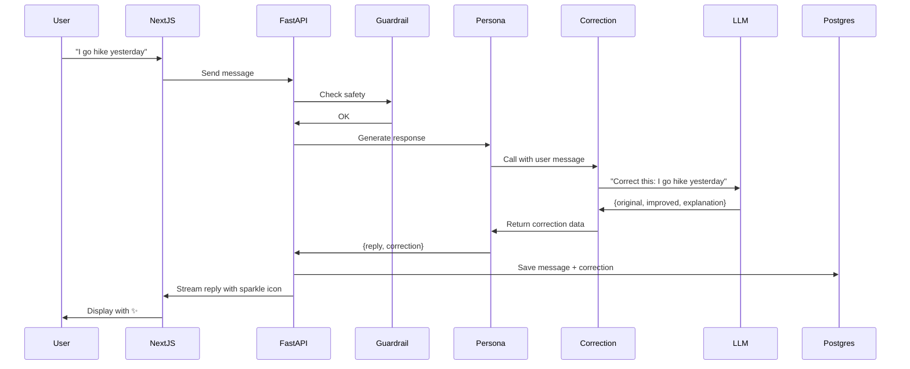

# EPIC-04: Pedagogical Layer

**Focus:** Subtle corrections, progress cards, learning metrics  
**Status:** Pending (Planned for Sprint 3)  
**Sprint:** Sprint 3: The Teacher  
**Priority:** P1 - High

---

## Epic Description

Implement the pedagogical features that transform NudgeEn from an entertaining chatbot into an effective English learning tool. This epic delivers subtle, non-intrusive corrections (Sparkle Icon), weekly progress summaries, and learning analytics that help users improve their language skills without breaking the natural flow of conversation. It balances the "friend" persona with educational value.

This epic builds on the memory foundation from EPIC-03 and adds the learning layer that differentiates NudgeEn from generic chatbots.

---

## Business Value

- **Learning Efficacy:** Users measurably improve English through natural interaction
- **Retention:** Educational value + friendship increases long-term engagement
- **Differentiation:** Pedagogical features vs pure entertainment chatbots
- **User Satisfaction:** Gentle corrections preserve friendship vibe while teaching

---

## Scope

### In Scope

- ✅ Subtle correction system (Sparkle Icon UX)
- ✅ Correction display modal (Original vs Improved vs Explanation)
- ✅ Grammar/vocabulary correction generation
- ✅ Correction severity levels (minor, moderate, major)
- ✅ Correction storage and tracking
- ✅ Weekly progress cards (automatic, in-chat)
- ✅ Learning metrics (new words, grammar trends, accuracy)
- ✅ Correction expansion rate tracking (% viewed by users)
- ✅ Vocabulary tracking (new words learned, review suggestions)
- ✅ Grammar rule categorization (tense, articles, prepositions, etc.)
- ✅ Progress visualization (trends over time)
- ✅ Correction confidence scoring
- ✅ User feedback on corrections (helpful/not helpful)
- ✅ Adaptive correction frequency (based on user level)
- ✅ Correction timing (immediate vs end-of-response)
- ✅ Memory integration (track corrected phrases in memory)
- ✅ Export progress data (PDF/CSV)
- ✅ Streaks and achievements (optional encouragement)

### Out of Scope

- ❌ Formal lesson plans or curriculum
- ❌ Flashcard system (spaced repetition)
- ❌ Grammar exercises or quizzes
- ❌ Pronunciation scoring (audio)
- ❌ Writing assignments or essays
- ❌ Teacher dashboard or parent controls
- ❌ Multi-language support (English only for MVP)
- ❌ Certification or testing

---

## Key Requirements

### REQ-PED-01: Subtle Correction UX

**From:** PRD-v1.md (REQ-003)

- Sparkle icon (✨) appears next to corrected messages
- Click/tap reveals correction details
- Non-intrusive (doesn't interrupt conversation flow)
- Optional: subtle animation on new corrections
- Hover tooltip shows brief explanation

### REQ-PED-02: Correction Modal

- Displays three panels side-by-side or stacked:
  1. **Original:** What user actually said
  2. **Improved:** Corrected version
  3. **Explanation:** 1-2 sentence grammar/vocabulary explanation
- Copy to clipboard functionality
- "Mark as helpful" button
- "Don't show similar corrections" option
- Close with Escape key or click outside

### REQ-PED-03: Correction Generation

- AI generates corrections as part of structured output
- Rule-based validation for common errors (tenses, articles)
- Confidence score (0-1) for each correction
- Severity levels:
  - Minor: Typos, article errors (a/an/the)
  - Moderate: Verb tense, word choice
  - Major: Sentence structure, meaning change needed
- Maximum 1-2 corrections per message (avoid overwhelming)

### REQ-PED-04: Correction Storage

```sql
CREATE TABLE message_corrections (
  id UUID PRIMARY KEY,
  message_id UUID REFERENCES messages(id),
  original_text TEXT NOT NULL,
  improved_text TEXT NOT NULL,
  explanation TEXT NOT NULL,
  grammar_rule VARCHAR(100),  -- tense, article, preposition, etc.
  severity VARCHAR(20),       -- minor, moderate, major
  confidence FLOAT,           -- 0.0 to 1.0
  viewed BOOLEAN DEFAULT false,
  marked_helpful BOOLEAN,
  created_at TIMESTAMPTZ DEFAULT NOW()
);
```

### REQ-PED-05: Weekly Progress Cards

**From:** PRD-v1.md (REQ-006)

- Auto-generated after 7 days of inactivity
- Delivered as in-chat system message
- Includes:
  - Most used new words (with definitions)
  - Grammar improvement trend (corrections over time)
  - Total messages this week
  - Accuracy improvement (if measurable)
  - Encouraging message
- Stored as `weekly_progress_cards` table

### REQ-PED-06: Learning Metrics

- New vocabulary count (unique words learned)
- Grammar accuracy rate (corrections per 100 messages)
- Most common error types (trends)
- Vocabulary retention (reused words)
- Conversation length trends
- Time between corrections (improving?)

### REQ-PED-07: Adaptive Corrections

- Beginner (A1-A2): More corrections, simpler explanations
- Intermediate (B1-B2): Moderate corrections
- Advanced (C1-C2): Few corrections, focus on nuance
- Configurable in settings: "Correct everything" vs "Only major errors"

### REQ-PED-08: Vocabulary Tracking

- Detect new words in user messages
- Check against known vocabulary list
- Track usage frequency
- Suggest review after 3, 7, 14 days (optional)
- Export as study list

### REQ-PED-09: User Feedback Loop

- "Was this correction helpful?" ✓/✗
- Optional comment on why
- Used to tune correction algorithm
- A/B test different explanation styles

### REQ-PED-10: Correction Timing

**Option A (Inline):** Correction appears immediately after message
**Option B (End):** All corrections shown at end of response
**Chosen:** Inline (Sparkle icon on corrected words/phrases)

---

## Technical Design

### Correction Generation Architecture



### Structured Output with Corrections

```json
{
  "reply": "Oh, you went hiking yesterday? That sounds cool! Where did you go?",
  "correction": {
    "has_correction": true,
    "original": "I go hike yesterday",
    "improved": "I went hiking yesterday",
    "explanation": "Use past tense 'went' for completed actions. 'Hiking' is the correct gerund form for the activity.",
    "grammar_rule": "past_simple_tense",
    "severity": "moderate",
    "confidence": 0.95
  }
}
```

### Correction Service

```python
# app/modules/pedagogy/services/correction_service.py

class CorrectionService:
    def __init__(self, llm_client):
        self.llm = llm_client
    
    async def generate_correction(
        self,
        user_text: str,
        user_level: str,
        context: Optional[str] = None
    ) -> Optional[Correction]:
        """Generate correction for user text."""
        
        # Skip if too short or likely correct
        if len(user_text.split()) < 3:
            return None
        
        prompt = self._build_correction_prompt(
            text=user_text,
            level=user_level,
            context=context
        )
        
        response = await self.llm.complete(
            prompt,
            response_format=CorrectionSchema
        )
        
        if not response.has_correction:
            return None
        
        return Correction(
            original_text=response.original,
            improved_text=response.improved,
            explanation=response.explanation,
            grammar_rule=response.grammar_rule,
            severity=self._classify_severity(response),
            confidence=response.confidence
        )
    
    def _build_correction_prompt(
        self,
        text: str,
        level: str,
        context: Optional[str]
    ) -> str:
        return f"""
        You are an English teacher correcting a student.
        Student level: {level}
        
        Task: Review the following sentence and suggest improvements.
        Be gentle and educational, not judgmental.
        
        Focus on:
        - Grammar errors (tense, agreement, articles)
        - Word choice
        - Natural phrasing
        
        Do NOT correct:
        - Minor typos (unless ambiguous)
        - Colloquialisms that are correct
        - Style preferences unless wrong
        
        User's sentence:
        "{text}"
        
        Context (if available):
        {context or 'None'}
        
        Response format (JSON):
        {{
          "has_correction": true/false,
          "original": "repeat original if correcting",
          "improved": "corrected version",
          "explanation": "1-2 sentence explanation",
          "grammar_rule": "tense/article/vocabulary/syntax",
          "confidence": 0.0-1.0
        }}
        """
```

### Sparkle Icon Component

```typescript
// components/chat/CorrectionBadge.tsx
import { Sparkles } from 'lucide-react'

interface CorrectionBadgeProps {
  correction: Correction
  onOpen: () => void
}

export function CorrectionBadge({ correction, onOpen }: CorrectionBadgeProps) {
  return (
    <button
      onClick={onOpen}
      className="inline-flex items-center gap-1 px-1.5 py-0.5 rounded-full 
                 bg-amber-100 hover:bg-amber-200 transition-colors"
      title="View correction"
    >
      <Sparkles className="w-3 h-3 text-amber-500" />
      <span className="text-xs text-amber-700 font-medium">
        Correction
      </span>
    </button>
  )
}

// Modal for correction details
export function CorrectionModal({ correction, isOpen, onClose }: CorrectionModalProps) {
  if (!isOpen) return null
  
  return (
    <div className="fixed inset-0 bg-black/50 flex items-center justify-center z-50">
      <div className="bg-white rounded-lg max-w-lg w-full mx-4 p-6">
        <h3 className="text-lg font-semibold mb-4">Correction Suggestion</h3>
        
        <div className="grid grid-cols-1 md:grid-cols-3 gap-4 mb-4">
          {/* Original */}
          <div className="bg-red-50 p-3 rounded">
            <h4 className="text-xs font-medium text-red-700 uppercase mb-1">
              Original
            </h4>
            <p className="text-red-900">{correction.original}</p>
          </div>
          
          {/* Improved */}
          <div className="bg-green-50 p-3 rounded">
            <h4 className="text-xs font-medium text-green-700 uppercase mb-1">
              Improved
            </h4>
            <p className="text-green-900">{correction.improved}</p>
          </div>
          
          {/* Explanation */}
          <div className="bg-blue-50 p-3 rounded">
            <h4 className="text-xs font-medium text-blue-700 uppercase mb-1">
              Explanation
            </h4>
            <p className="text-blue-900 text-sm">{correction.explanation}</p>
          </div>
        </div>
        
        <div className="flex items-center justify-between">
          <span className="text-sm text-gray-500">
            Rule: {correction.grammar_rule} | 
            Confidence: {(correction.confidence * 100).toFixed(0)}%
          </span>
          
          <div className="flex gap-2">
            <button
              onClick={() => {
                markHelpful(correction.id, true)
                onClose()
              }}
              className="px-3 py-1.5 bg-green-100 text-green-700 rounded hover:bg-green-200 text-sm"
            >
              ✓ Helpful
            </button>
            <button
              onClick={() => {
                markHelpful(correction.id, false)
                onClose()
              }}
              className="px-3 py-1.5 bg-gray-100 text-gray-700 rounded hover:bg-gray-200 text-sm"
            >
              Not helpful
            </button>
          </div>
        </div>
        
        <button
          onClick={onClose}
          className="absolute top-4 right-4 text-gray-400 hover:text-gray-600"
        >
          ✕
        </button>
      </div>
    </div>
  )
}
```

### Weekly Progress Card

```python
# workers/tasks/progress.py
@broker.task(queue="heavy")
async def generate_weekly_progress(user_id: str):
    """Generate weekly learning progress card."""
    async with get_db() as session:
        # Get week's data
        week_ago = datetime.utcnow() - timedelta(days=7)
        
        messages = await session.execute(
            select(Message)
            .where(Message.user_id == user_id)
            .where(Message.created_at >= week_ago)
        )
        
        corrections = await session.execute(
            select(MessageCorrection)
            .join(Message)
            .where(Message.user_id == user_id)
            .where(Message.created_at >= week_ago)
        )
        
        # Calculate metrics
        total_messages = len(messages.scalars().all())
        total_corrections = len(corrections.scalars().all())
        
        # Extract new vocabulary
        new_words = await extract_new_vocabulary(session, user_id, week_ago)
        
        # Grammar trends
        correction_by_rule = {}
        for c in corrections.scalars():
            rule = c.grammar_rule or "other"
            correction_by_rule[rule] = correction_by_rule.get(rule, 0) + 1
        
        # Build card content
        card = WeeklyProgressCard(
            user_id=user_id,
            week_ending=datetime.utcnow().date(),
            messages_sent=total_messages,
            corrections_received=total_corrections,
            new_words=new_words,
            top_error_types=correction_by_rule,
            accuracy_trend=calculate_trend(session, user_id),
            generated_at=datetime.utcnow()
        )
        
        session.add(card)
        await session.commit()
        
        # Send as system message
        await send_progress_card(user_id, card)
```

### Vocabulary Tracking

```python
class VocabularyTracker:
    def __init__(self, db_session):
        self.db = db_session
        self.known_words_cache = {}
    
    async def extract_new_words(
        self,
        user_id: str,
        text: str
    ) -> list[NewWord]:
        """Identify potentially new vocabulary in user text."""
        
        # Tokenize and lemmatize
        words = self._extract_content_words(text)
        
        # Check against known vocabulary
        known = await self.get_known_vocabulary(user_id)
        new_words = [w for w in words if w.lemma not in known]
        
        # Filter common words
        new_words = [w for w in new_words if not self.is_common(w.lemma)]
        
        # Store as potential vocabulary
        for word in new_words:
            await self.record_vocabulary_encounter(user_id, word)
        
        return new_words
    
    def is_advanced_vocabulary(self, word: str) -> bool:
        """Check if word is above user's level."""
        # Use CEFR word lists
        return word in ADVANCED_VOCAB
```

---

## Acceptance Criteria

### Must Have

- [ ] Sparkle icon appears on corrected messages
- [ ] Correction modal opens with original/improved/explanation
- [ ] Corrections generated for grammar errors (tense, articles, etc.)
- [ ] Corrections stored in database with all fields
- [ ] Weekly progress card generated after 7 days inactive
- [ ] Progress card includes: new words, grammar trends, message count
- [ ] Learning metrics dashboard in settings
- [ ] User can mark corrections as helpful/not helpful
- [ ] Correction confidence scores tracked
- [ ] Adaptive correction frequency by user level
- [ ] Vocabulary tracking and new word detection
- [ ] Correction severity classification (minor/moderate/major)
- [ ] Export progress data (CSV)

### Should Have

- [ ] Copy correction to clipboard
- [ ] Streak tracking for consecutive days
- [ ] Achievement badges (optional)
- [ ] Review suggestions for learned words
- [ ] Comparison with previous week

### Could Have

- [ ] Custom correction preferences per user
- [ ] A/B testing for explanation styles
- [ ] Integration with spaced repetition system
- [ ] Pronunciation suggestions (text-based)

### Won't Have (This Epic)

- ❌ Formal lessons, quizzes, or tests
- ❌ Flashcard system
- ❌ Writing assignments
- ❌ Pronunciation scoring
- ❌ Multi-language support

---

## Dependencies

### External Dependencies

- **LLM APIs** (Gemini/Groq) - For correction generation
- **CEFR vocabulary lists** - For word level classification

### Internal Dependencies

- **EPIC-00:** Infrastructure, database setup
- **EPIC-01:** Authentication, user profiles
- **EPIC-02:** Messaging system, message storage
- **EPIC-03:** Memory system, user context

---

## Timeline & Milestones

**Sprint 3: The Teacher** (Target: 3 weeks)

| Milestone | Target Date | Deliverable |
|-----------|-------------|-------------|
| M1 | Week 1 Day 2 | Correction generation service |
| M2 | Week 1 Day 4 | Sparkle icon UI component |
| M3 | Week 1 Day 7 | Correction modal working |
| M4 | Week 2 Day 2 | Database schema for corrections |
| M5 | Week 2 Day 4 | Weekly progress card generator |
| M6 | Week 2 Day 7 | Vocabulary tracking implemented |
| M7 | Week 3 Day 2 | Learning metrics dashboard |
| M8 | Week 3 Day 4 | Adaptive correction levels |
| M9 | Week 3 Day 6 | User feedback on corrections |
| M10 | Week 3 Day 7 | Epic-04 acceptance criteria met |

---

## Risks & Mitigations

| Risk | Impact | Probability | Mitigation |
|------|--------|-------------|------------|
| Over-correction annoys users | High | Medium | Limit to 1-2 per message, severity-based |
| Corrections are wrong | High | Low | Confidence scores, human review option |
| Explanations too complex | Medium | Medium | Level-adaptive explanations |
| Users ignore corrections | Medium | High | Make engaging, track effectiveness |
| Performance impact on streaming | Low | Medium | Generate corrections in parallel |

---

## Success Metrics

- **Correction Expansion Rate:** > 60% of users click sparkle icons
- **Correction Helpfulness:** > 70% marked as helpful
- **Learning Progress:** Measurable reduction in repeated errors
- **New Vocabulary:** Average 5-10 new words per week per active user
- **Weekly Card Open Rate:** > 50% of recipients
- **User Retention:** D7 retention > 25% (PRD target)
- **Grammar Accuracy:** 20% reduction in same error type over 4 weeks
- **User Satisfaction:** > 4/5 stars for educational value

---

## Out of Scope for This Epic

The following will be addressed in their respective epics:

- **EPIC-00-03:** Infrastructure, auth, messaging, memory foundations
- **EPIC-05:** Production deployment, scaling, observability

---

## References

- [PRD-v1.md](../../PRD-v1.md) - Product requirements (REQ-003, REQ-006)
- [ARCHITECTURE.md](../../ARCHITECTURE.md) - System architecture
- [TECHSTACK.md](../../TECHSTACK.md) - Technology choices
- [PRINCIPLES.md](../../PRINCIPLES.md) - Design principles (Pedagogy as sidekick)

---

## Revision History

| Version | Date | Author | Description |
|---------|------|--------|-------------|
| 1.0 | 2026-04-26 | System | Initial version based on project documentation |
